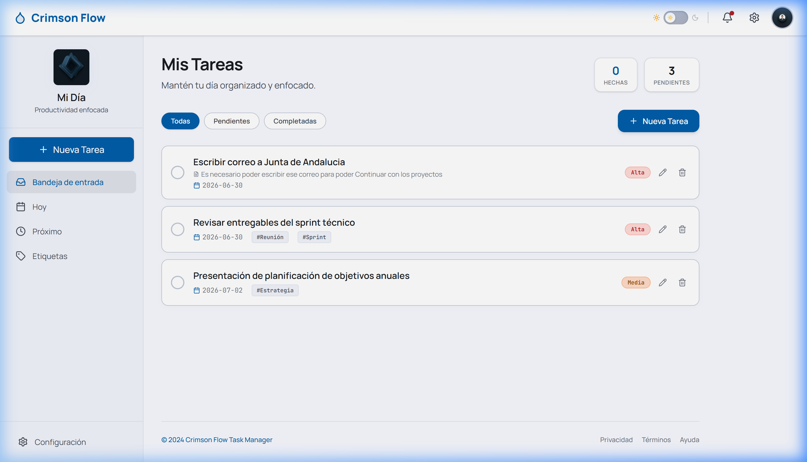
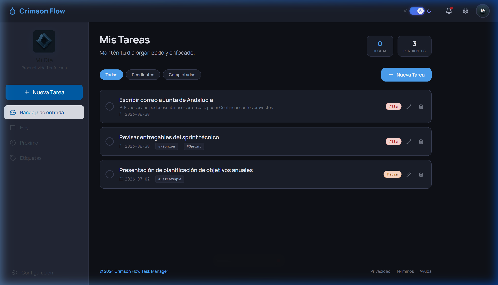
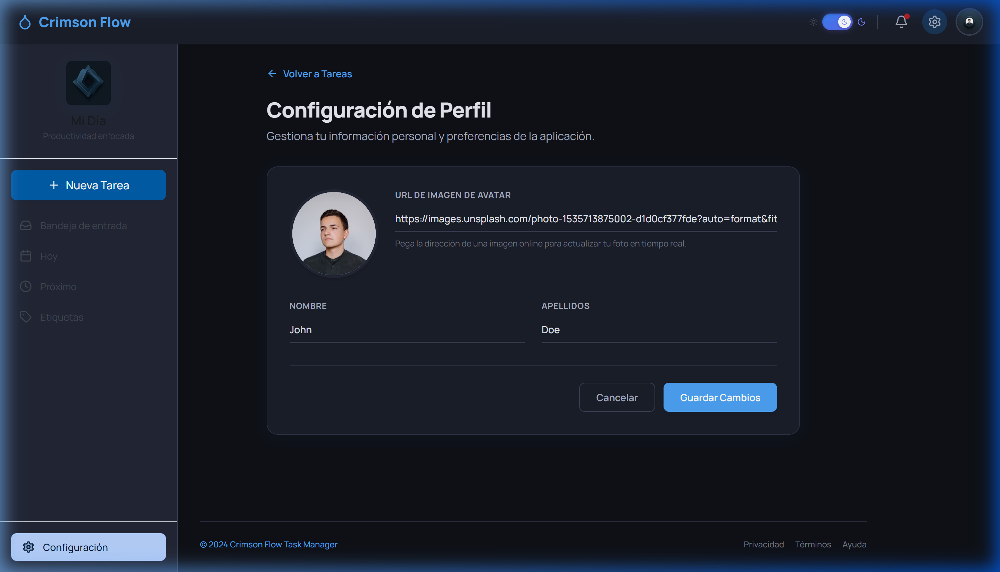
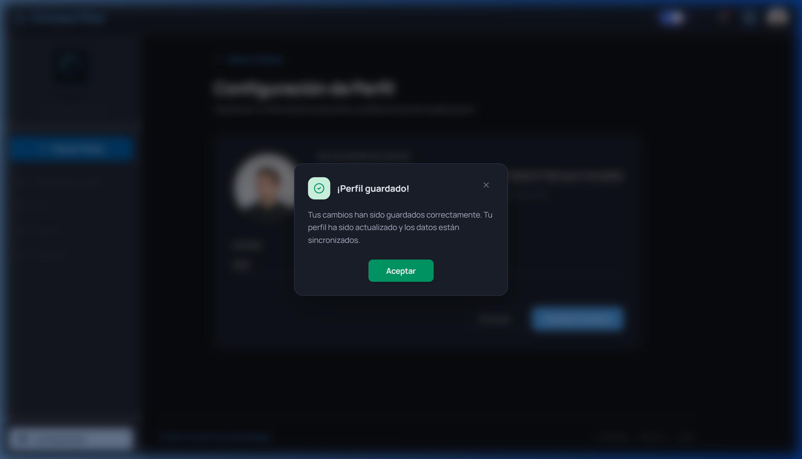

# 🌊 Crimson Flow — Gestor de Tareas Personales

<div align="center">
  
  
  [](https://github.com/Yoangel-dev)
  [](https://react.dev)
  [](https://tailwindcss.com)
  [](https://www.typescriptlang.org)
</div>

---

## 📝 Descripción del Proyecto

**Crimson Flow** es una aplicación web premium, responsiva y altamente estética diseñada para la gestión de tareas personales diarias. Combina una interfaz fluida e interactiva con características avanzadas de diseño como modo oscuro adaptativo, modales dinámicos, accesibilidad mediante teclado, y persistencia local completa.

Desarrollada bajo estándares profesionales por **Yoangel-dev Soluciones Web**.

---

## ✨ Características Principales

*   **Crear y Editar Tareas**: Interfaz intuitiva a través de un modal dinámico (`TaskModal`) que permite asignar título, descripción opcional, fecha de vencimiento, prioridad (Alta, Media, Baja) y etiquetas múltiples.
*   **Modo Claro / Oscuro**: Interruptor deslizante con transiciones suaves en toda la interfaz, respetando la configuración inicial del sistema y guardando la preferencia del usuario en `localStorage`.
*   **Feedback Visual Avanzado**:
    *   *Hover*: Las tarjetas de tareas se elevan sutilmente (`translate-y`) y aumentan su sombra al pasar el cursor.
    *   *Focus*: Soporte completo de navegación por teclado mediante `focus-within`. Al enfocar cualquier elemento de la tarjeta (checkbox, editar, eliminar), toda la tarjeta resalta su borde de forma elegante.
*   **Eliminación Segura**: Ventana modal de confirmación antes de eliminar cualquier tarea para evitar pérdidas accidentales.
*   **Gestión de Perfil Personalizado**: Permite actualizar el nombre, apellidos y la URL del avatar con **previsualización reactiva e inmediata** al perder el foco del input.
*   **Persistencia Local**: Almacenamiento automático y lectura en `localStorage` de todas las tareas y configuración de perfil.
*   **Filtros Inteligentes**: Clasificación por pestañas de navegación (Bandeja, Hoy, Próximo, Etiquetas) y chips de filtrado rápido (*Todas*, *Pendientes*, *Completadas*).

---

## 📸 Vista de la Aplicación

### 1. Panel Principal (Tema Claro)
El diseño moderno muestra las tareas activas, estadísticas rápidas de progreso en la parte superior derecha, accesos rápidos de filtros y la acción principal "Nueva Tarea".


### 2. Panel Principal (Tema Oscuro)
El modo oscuro adapta de forma fluida todas las paletas de colores para un uso cómodo en entornos de baja luminosidad.


### 3. Configuración de Perfil y Previsualización del Avatar
El formulario incluye la actualización inmediata del avatar al pegar la URL de cualquier imagen en línea, mostrando la vista previa en tiempo real.


### 4. Modales de Confirmación y Sincronización
Los popups para guardar datos y eliminar tareas siguen una línea de diseño unificada con animaciones fluidas impulsadas por *Framer Motion*.


---

## 🎥 Grabación de Demostración de Funcionalidades

Puedes ver la demostración interactiva completa de la aplicación, incluyendo el cambio de tema, la creación/edición de tareas y el flujo del avatar aquí:

*   🎬 [Ver grabación de verificación de Tema Oscuro y Avatar](assets/dark_mode_verification.webp)

---

## 🛠️ Stack Tecnológico

*   **Frontend Library**: React 19 (Hooks, Context API)
*   **Language**: TypeScript
*   **Styling**: Tailwind CSS v4.0 (con CSS Variables)
*   **Icons**: Lucide React
*   **Animations**: Framer Motion
*   **Build Tool**: Vite

---

## 🚀 Instalación y Ejecución Local

Sigue estos pasos para levantar el entorno de desarrollo local:

### Requisitos Previos
*   [Node.js](https://nodejs.org/) (Versión 18 o superior recomendada)

### Pasos

1.  **Clonar el repositorio**:
    ```bash
    git clone <url-del-repositorio>
    cd 01-tareas-pendientes
    ```

2.  **Instalar las dependencias**:
    ```bash
    npm install
    ```

3.  **Iniciar el servidor de desarrollo**:
    ```bash
    npm run dev
    ```

4.  **Abrir en el navegador**:
    Visita `http://localhost:3000` (o el puerto asignado en consola) para empezar a usar Crimson Flow.

---

<div align="center">
  <p><b>Desarrollado con ❤️ por Yoangel-dev Soluciones Web</b></p>
  <p><i>© 2026 Crimson Flow Task Manager. Todos los derechos reservados.</i></p>
</div>
