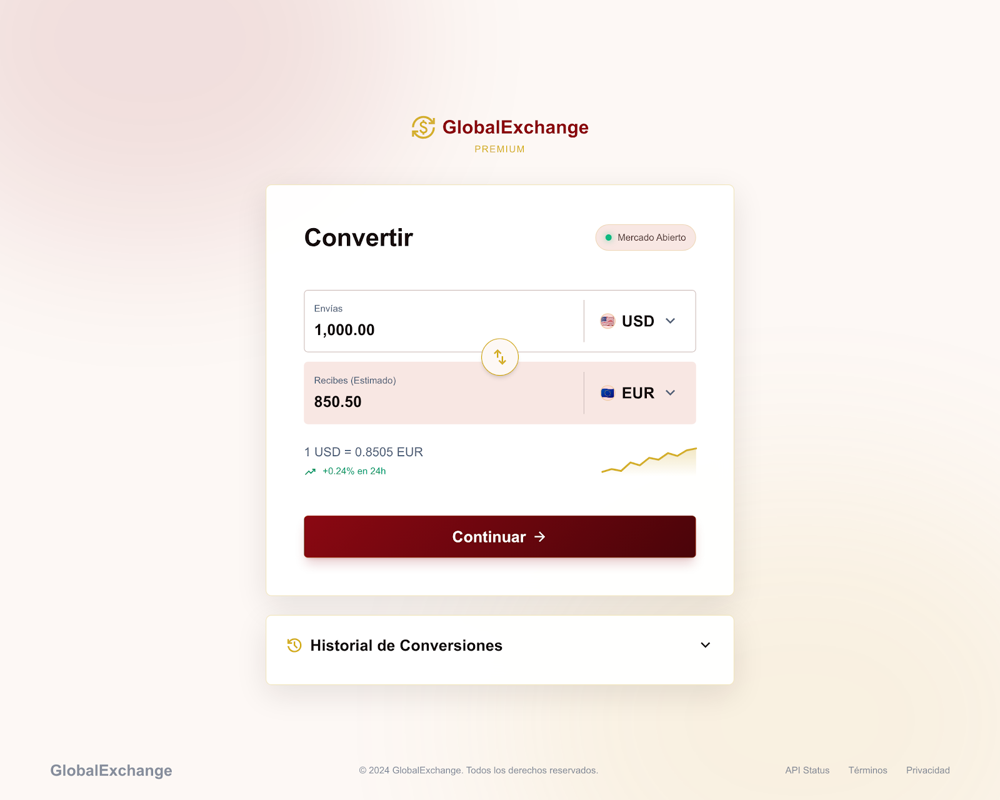

# 🌍 GlobalExchange Premium — Conversor de Monedas

<p align="center">
  
</p>

<p align="center">
  <strong>Conversor de divisas en tiempo real con más de 150 monedas, historial de conversiones y diseño premium.</strong>
</p>

<p align="center">
  
  
  
  
</p>

---

## 📋 Descripción del Proyecto

**GlobalExchange Premium** es una aplicación web de conversión de divisas construida con HTML5, CSS3 y JavaScript Vanilla (sin dependencias externas). Consume una API REST externa para obtener las tasas de cambio en tiempo real y dispone de un sistema de respaldo local para garantizar el funcionamiento incluso sin conexión a internet.

La interfaz sigue un diseño minimalista y premium con fondo degradado cálido, tarjetas blancas, tipografía Inter y una paleta de colores en tonos granate y dorado.

---

## ✨ Funcionalidades

| Funcionalidad | Descripción |
|---|---|
| 🔄 **Conversión en tiempo real** | El resultado se actualiza automáticamente mientras el usuario escribe, sin necesidad de pulsar ningún botón |
| 🌐 **API externa de tipos de cambio** | Consume `https://cdn.moneyconvert.net/api/latest.json` con más de 150 monedas actualizadas |
| 📡 **Fallback local** | Si la API falla o no hay conexión, carga automáticamente el archivo `assets/rates-fallback.json` |
| ⚠️ **Manejo de errores de red** | Muestra un mensaje visual informativo cuando se usa el fallback o hay un error de red |
| ⏳ **Indicador de carga** | Muestra un spinner animado mientras se obtienen los datos del API |
| 💱 **Swap de monedas** | Botón para intercambiar la moneda origen y destino en un solo clic (con animación de rotación) |
| 🏦 **+150 divisas** | Soporte completo con emojis de banderas para identificar cada moneda visualmente |
| 📜 **Historial de conversiones** | Almacena las últimas 10 conversiones en el `localStorage` del navegador |
| 🗂️ **Panel colapsable** | El historial aparece plegado y se expande con un clic (con animación suave) |
| 🗑️ **Borrar historial** | Botón para limpiar todas las entradas guardadas |
| 📱 **Diseño Responsive** | Adaptado para móviles, tablets y escritorio |
| ♿ **Accesibilidad** | Atributos ARIA, roles semánticos y etiquetas descriptivas en todos los elementos interactivos |

---

## 🖼️ Capturas de Pantalla

<p align="center">
  
</p>

La interfaz reproduce fielmente el diseño de referencia:

- **Fondo**: degradado cálido rosáceo/crema
- **Logo**: GlobalExchange con ícono dorado y subtítulo "PREMIUM"
- **Card principal**: blanca con sombra suave, radio grande
- **Campo "Envías"**: fondo blanco con borde
- **Campo "Recibes"**: fondo rosáceo distinguido del campo de entrada
- **Botón swap**: circular dorado con animación de 180° al hacer hover
- **Badge** "Mercado Abierto": con punto verde pulsante
- **Tasa de cambio**: con mini-gráfico de tendencia dorado
- **Botón "Continuar"**: granate oscuro con efecto hover elevado

---

## 🚀 Cómo Usar la Aplicación

### Prerrequisitos

No se necesita instalar nada. Basta con un servidor web local (XAMPP, WAMP, Live Server de VS Code, etc.) para que el fetch al archivo fallback JSON funcione correctamente.

> ⚠️ **No abrir directamente con `file://`** — el fetch al fallback local requiere un servidor HTTP.

### Pasos

1. **Clona o descarga** el repositorio en la carpeta del servidor (ej. `htdocs/03-monedas`).
2. **Abre en el navegador** la URL del servidor local:  
   `http://localhost/master-antigravity/03-monedas/`
3. **Selecciona** la moneda de origen y destino en los desplegables.
4. **Escribe** la cantidad a convertir — el resultado se muestra automáticamente.
5. **Pulsa "Continuar"** para guardar la conversión en el historial.
6. **Expande "Historial de Conversiones"** para ver las últimas 10 operaciones.

---

## 🔧 Cómo Funciona Cada Opción

### Selección de Moneda

Los desplegables se pueblan dinámicamente con los códigos de moneda obtenidos de la API. Las monedas más comunes (USD, EUR, GBP, JPY…) aparecen al principio de la lista. Cada opción muestra el emoji de la bandera del país correspondiente.

### Conversión en Tiempo Real

Usando el evento `input` sobre el campo de cantidad, la aplicación recalcula el resultado sin demora. La fórmula utilizada es:

```
resultado = (cantidad ÷ tasa_origen_en_USD) × tasa_destino_en_USD
```

Esto permite convertir entre cualquier par de monedas, incluso cuando la base del API es USD.

### Fallback de Red

La carga de tasas funciona en dos etapas:

1. **Intento primario**: `fetch` a `https://cdn.moneyconvert.net/api/latest.json`
2. **Intento secundario**: si falla (timeout, error HTTP, sin conexión), `fetch` a `assets/rates-fallback.json`
3. **Error crítico**: si ambos fallan, se muestra un mensaje de error en pantalla.

### Historial con localStorage

Cada vez que el usuario pulsa "Continuar", se crea una entrada que incluye:
- Cantidad enviada y moneda origen
- Cantidad recibida y moneda destino
- Tasa de cambio aplicada
- Fecha y hora de la conversión

Se almacena como array JSON en `localStorage` bajo la clave `globalexchange_historial`. Se mantienen solo las **últimas 10 entradas**.

### Indicador de Carga

Durante la petición al API, se muestra un spinner animado con el texto "Actualizando tasas de cambio…". Se oculta automáticamente cuando la petición finaliza (éxito o fallback).

---

## 📁 Estructura del Proyecto

```
03-monedas/
│
├── index.html                  # Documento HTML principal (semántico, en español)
│
├── css/
│   └── style.css               # Hoja de estilos CSS3 (sin frameworks)
│
├── js/
│   └── app.js                  # Lógica JavaScript Vanilla completa
│
├── assets/
│   └── rates-fallback.json     # Copia local de las tasas (fallback de red)
│
├── design/
│   └── screen.png              # Diseño de referencia de la interfaz
│
├── img/                        # Carpeta para imágenes adicionales (futura expansión)
│
├── AGENTS.md                   # Especificaciones del agente de desarrollo
└── README.md                   # Este archivo
```

---

## 🛠️ Requisitos Técnicos

- Navegador moderno con soporte para:
  - `fetch` API
  - `localStorage`
  - CSS Custom Properties (variables)
  - CSS Grid / Flexbox
  - `Intl.NumberFormat` / `Intl.DateTimeFormat`
- Servidor HTTP local (XAMPP, WAMP, Live Server, etc.)
- Conexión a internet (opcional — funciona con fallback si no hay)

---

## 🧑‍💻 Stack Tecnológico

| Tecnología | Uso |
|---|---|
| **HTML5** | Estructura semántica, ARIA, formularios accesibles |
| **CSS3** | Variables, Flexbox, Grid, animaciones, responsive |
| **JavaScript ES6+** | `fetch`, `async/await`, `localStorage`, DOM API |
| **Google Fonts — Inter** | Tipografía premium y legible |
| **API MoneyConvert** | Tasas de cambio en tiempo real |

---

## 📌 Notas de Desarrollo

- No se utiliza `innerHTML` en ningún momento — todo el contenido dinámico se crea con `document.createElement` y `appendChild`.
- No se usan `alert`, `confirm` ni `prompt` — todo el feedback es visual en el DOM.
- El código sigue principios de legibilidad: funciones cortas, comentarios descriptivos y separación clara de responsabilidades.
- El archivo `assets/rates-fallback.json` debe actualizarse periódicamente para mantener tasas aproximadas en caso de fallo del API.

---

## 👨‍💼 Créditos y Autoría

Desarrollado por **[Yoangel-dev Soluciones Web](https://github.com/Yoangel-dev)**

> Proyecto educativo desarrollado como parte del máster en desarrollo web. Todos los derechos reservados © 2024 GlobalExchange.

---

<p align="center">
  Hecho con ❤️ y ☕ · <strong>Yoangel-dev Soluciones Web</strong>
</p>
